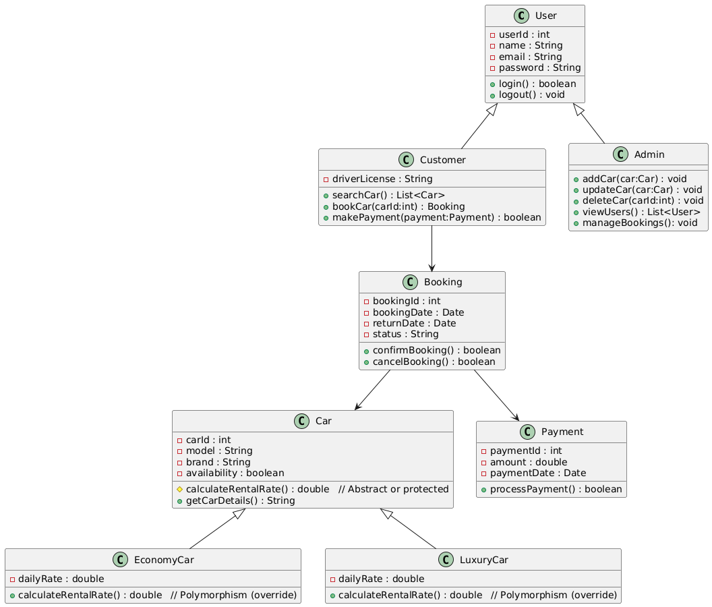
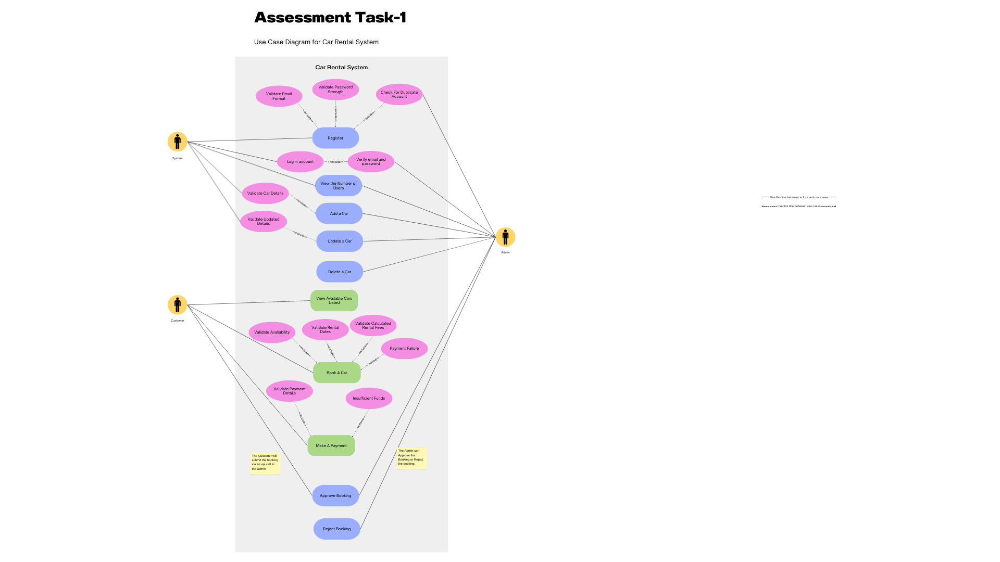
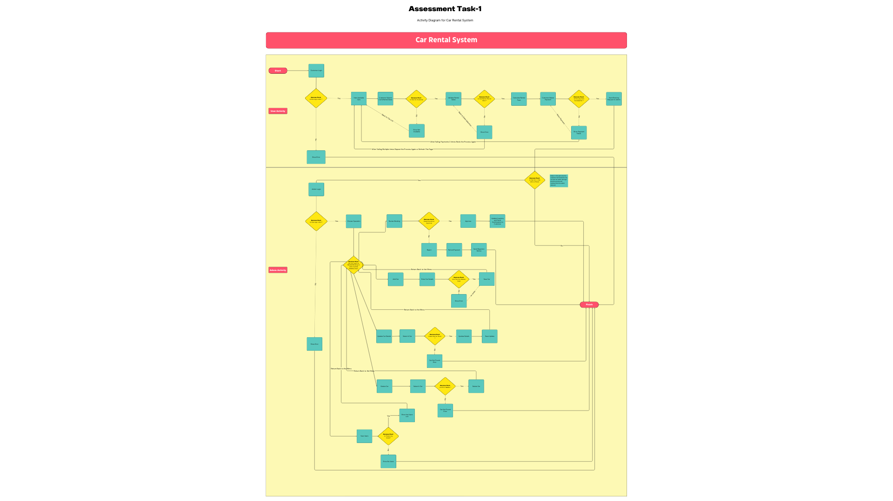
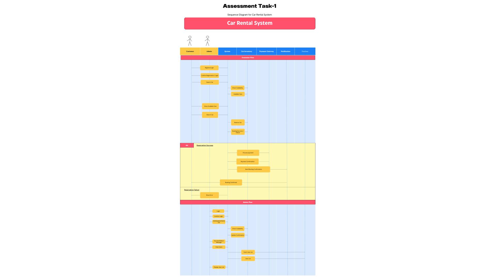

# 🚗 Car Rental System

A simple yet effective **Car Rental Management System** built with **Python** and **MySQL**.  
This project demonstrates **object-oriented design** with appropriate **design patterns** and includes an **innovative feature** (QR code pickup/return) to set it apart from traditional systems.

---

## 📑 Table of Contents
- [Overview](#overview)
- [Features](#features)
- [System Architecture](#system-architecture)
- [Design Pattern Used](#design-pattern-used)
- [Innovative Feature](#innovative-feature)
- [Project Structure](#project-structure)
- [Installation & Setup](#installation--setup)
- [Usage](#usage)
- [Database Schema](#database-schema)
- [Seed Data](#seed-data)
- [Validation Rules](#validation-rules)
- [Known Issues](#known-issues)
- [License](#license)
- [Credits](#credits)

---

## 📖 Overview
The Car Rental System streamlines **car discovery, booking, approvals, pickup/return, and payments**.  
It supports both **customers** (browse, book) and **admins** (manage cars, customers, and bookings).

This project fulfills:

- **Task 1 (Design & Architecture)**  
  - Modular Python services & controllers  
  - High-level component/class diagrams (see `/diagrams`)  
  - Clear interaction description and separation of concerns
- **Task 2 (Innovative Solutions)**  
  - **QR Code–based pickup & return**: unique token per booking, terminal ASCII QR, and PNG generation

---

## ✨ Features
- **Role-based login** (admin/customer) with hashed passwords (bcrypt)
- **Admin**:
  - Add / Update / Delete cars
  - Approve / Reject bookings
  - Delete customers (safeguard: cannot delete admins)
- **Customer**:
  - View available cars (date-aware availability)
  - Create bookings (pending → admin approval)
  - View QR code for approved bookings
- **QR codes**:
  - Generated on **approval**
  - Printed as **ASCII** in terminal and saved as **PNG**
  - **Pickup**: scan token → booking → `active`, car locked
  - **Return**: scan token → booking → `completed`, car released
- **MySQL persistence** for users, cars, bookings, payments, QR tokens

---

## 🏗️ System Architecture

### UML Class Diagram


### Use Case Diagram


### Activity Diagram


### Sequence Diagram


> Diagrams are provided as images. See `/diagrams/` for the source files/screenshots you created.

---

## 🎨 Design Pattern Used
- **Factory Method (design/architecture)**  
  Used conceptually for entity creation (e.g., different `Vehicle` subtypes or future `UserFactory` for `Admin`/`Customer`).  
  This promotes **modularity** and **extensibility** when adding new vehicle types or user types.

> The running code focuses on role-based services & controllers; the factory is documented in the architecture to satisfy LO1 and can be implemented later without refactoring the rest.

---

## 🚀 Innovative Feature
### QR Code–Based Pickup & Return
- On **approval**, the system creates a unique **token** per booking, stores it in `booking_qr_codes`, prints an **ASCII QR** in terminal, and saves a **PNG** in `/qrcodes`.
- Admin can **scan** (type/paste) the token in terminal:
  - **Pickup** → booking → `active`, car → `available_now = FALSE`
  - **Return** → booking → `completed`, car → `available_now = TRUE`

Why it helps:
- Faster & paperless handover
- Clear audit trail and simple terminal workflow
- Easy to extend to mobile apps / IoT locks later

---

## 🗂️ Project Structure
Car_Rental_System/
│── main.py
│── config/
│ └── db_config.py
│── controllers/
│ ├── user_controller.py
│ ├── car_controller.py
│ └── (optional) admin_controller.py, customer_controller.py
│── services/
│ ├── userservice.py
│ ├── car_service.py
│ ├── booking_service.py
│ └── qr_service.py
│── models/
│ ├── user.py
│ ├── car.py
│ └── rental.py
│── utils/
│ ├── validators.py
│ ├── security.py # bcrypt helpers
│ └── qrcode_utils.py # PNG + ASCII QR generation
│── db/
│ ├── schema.sql
│ └── seed.sql
│── qrcodes/ # generated QR PNGs (gitignored if you want)
│── diagrams/
│ ├── class-diagram.png
│ ├── use-case-diagram.png
│ ├── activity-diagram.png
│ └── sequence-diagram.png
└── requirements.txt


---

## ⚙️ Installation & Setup

### 1) Python & MySQL
- Python 3.10+ recommended
- MySQL 8.0+

### 2) Install dependencies
```bash
pip install -r requirements.txt

3) Configure DB

Edit config/db_config.py to match your local MySQL credentials:

# config/db_config.py
import mysql.connector

def get_db_connection():
    return mysql.connector.connect(
        host="localhost",
        user="root",
        password="YOUR_PASSWORD",
        database="car_rental"
    )

4) Create schema & seed data

Copy /db/schema.sql and /db/seed.sql from the sections below into files and run them in MySQL Workbench or CLI:

mysql -u root -p < db/schema.sql
mysql -u root -p < db/seed.sql

5) Run the app (CLI)
python main.py


If you prefer package-style execution, add __init__.py files and run python -m Car_Rental_System.main.

🕹️ Usage
Main Menu (CLI)

Register → creates a customer/admin (admin typically seeded or promoted)

Login → routes to:

Admin Dashboard:

Add / Update / Delete car

List all cars

Approve / Reject bookings (approval triggers QR generation)

Scan QR for Pickup / Return

Delete customer (admin-only safeguard)

Customer Dashboard:

View available cars

Book a car (pending → admin approves)

Show QR for approved booking (reprint ASCII/PNG path)

Passwords are securely hashed with bcrypt.

🧱 Database Schema

DB: car_rental
Tables: users, cars, bookings, payments, booking_qr_codes and view v_available_cars.

Place this as db/schema.sql:

CREATE DATABASE IF NOT EXISTS car_rental
  CHARACTER SET utf8mb4 COLLATE utf8mb4_0900_ai_ci;
USE car_rental;

-- USERS
CREATE TABLE IF NOT EXISTS users (
    user_id    INT AUTO_INCREMENT PRIMARY KEY,
    name       VARCHAR(100) NOT NULL,
    email      VARCHAR(100) NOT NULL UNIQUE,
    password   VARCHAR(255) NOT NULL,
    role       ENUM('customer','admin') NOT NULL DEFAULT 'customer',
    created_at TIMESTAMP NOT NULL DEFAULT CURRENT_TIMESTAMP,
    updated_at TIMESTAMP NULL DEFAULT NULL ON UPDATE CURRENT_TIMESTAMP
) ENGINE=InnoDB;
CREATE INDEX idx_users_email ON users(email);

-- CARS
CREATE TABLE IF NOT EXISTS cars (
    car_id          INT AUTO_INCREMENT PRIMARY KEY,
    brand           VARCHAR(100) NOT NULL,
    model           VARCHAR(100) NOT NULL,
    year            INT NULL,
    mileage         INT NULL,
    daily_rate      DECIMAL(10,2) NOT NULL DEFAULT 0.00,
    min_period_days INT NULL,
    max_period_days INT NULL,
    available_now   BOOLEAN NOT NULL DEFAULT TRUE,
    created_at      TIMESTAMP NOT NULL DEFAULT CURRENT_TIMESTAMP,
    updated_at      TIMESTAMP NULL DEFAULT NULL ON UPDATE CURRENT_TIMESTAMP
) ENGINE=InnoDB;
CREATE INDEX idx_cars_available ON cars(available_now);
CREATE INDEX idx_cars_brand_model ON cars(brand, model);

-- BOOKINGS
CREATE TABLE IF NOT EXISTS bookings (
    booking_id    INT AUTO_INCREMENT PRIMARY KEY,
    user_id       INT NOT NULL,
    car_id        INT NOT NULL,
    start_date    DATE NOT NULL,
    end_date      DATE NOT NULL,
    status        ENUM('pending','approved','rejected','active','completed','cancelled')
                  NOT NULL DEFAULT 'pending',
    total_cost    DECIMAL(10,2) NULL,
    approved_by   INT NULL,
    pickup_at     DATETIME NULL,
    return_at     DATETIME NULL,
    created_at    TIMESTAMP NOT NULL DEFAULT CURRENT_TIMESTAMP,
    updated_at    TIMESTAMP NULL DEFAULT NULL ON UPDATE CURRENT_TIMESTAMP,
    CONSTRAINT fk_bookings_user  FOREIGN KEY (user_id)     REFERENCES users(user_id)
      ON DELETE CASCADE ON UPDATE CASCADE,
    CONSTRAINT fk_bookings_car   FOREIGN KEY (car_id)      REFERENCES cars(car_id)
      ON DELETE RESTRICT ON UPDATE CASCADE,
    CONSTRAINT fk_bookings_admin FOREIGN KEY (approved_by) REFERENCES users(user_id)
      ON DELETE SET NULL ON UPDATE CASCADE,
    CONSTRAINT chk_booking_dates CHECK (end_date >= start_date)
) ENGINE=InnoDB;
CREATE INDEX idx_bookings_user   ON bookings(user_id);
CREATE INDEX idx_bookings_car    ON bookings(car_id);
CREATE INDEX idx_bookings_status ON bookings(status);
CREATE INDEX idx_bookings_dates  ON bookings(start_date, end_date);

-- PAYMENTS
CREATE TABLE IF NOT EXISTS payments (
    payment_id      INT AUTO_INCREMENT PRIMARY KEY,
    booking_id      INT NOT NULL,
    amount          DECIMAL(10,2) NOT NULL,
    payment_method  ENUM('credit_card','debit_card','cash','paypal') NOT NULL DEFAULT 'cash',
    payment_status  ENUM('pending','paid','failed','refunded') NOT NULL DEFAULT 'pending',
    provider_txn_id VARCHAR(100) NULL,
    payment_date    DATETIME NOT NULL DEFAULT CURRENT_TIMESTAMP,
    CONSTRAINT fk_payments_booking FOREIGN KEY (booking_id) REFERENCES bookings(booking_id)
      ON DELETE CASCADE ON UPDATE CASCADE
) ENGINE=InnoDB;
CREATE INDEX idx_payments_booking ON payments(booking_id);
CREATE INDEX idx_payments_status  ON payments(payment_status);

-- QR CODE TOKENS
CREATE TABLE IF NOT EXISTS booking_qr_codes (
    qr_id       INT AUTO_INCREMENT PRIMARY KEY,
    booking_id  INT NOT NULL UNIQUE,
    qr_token    VARCHAR(128) NOT NULL UNIQUE,
    expires_at  DATETIME NULL,
    created_at  TIMESTAMP NOT NULL DEFAULT CURRENT_TIMESTAMP,
    CONSTRAINT fk_qr_booking FOREIGN KEY (booking_id) REFERENCES bookings(booking_id)
      ON DELETE CASCADE ON UPDATE CASCADE
) ENGINE=InnoDB;
CREATE INDEX idx_qr_token ON booking_qr_codes(qr_token);

-- VIEW
CREATE OR REPLACE VIEW v_available_cars AS
SELECT car_id, brand, model, year, mileage, daily_rate
FROM cars
WHERE available_now = TRUE;

🌱 Seed Data

Place this as db/seed.sql and run after schema.sql:

USE car_rental;

START TRANSACTION;

-- Admin + Customer (bcrypt hashes)
-- Admin password:    AdminPass123!
-- Customer password: CustomerPass123!
INSERT INTO users (name, email, password, role) VALUES
('Alice Admin',   'admin@carrental.com', '$2b$12$roomjk62e3NBDhYtZqxloeu2Ek7.l7Ea0CYvt2v6yMUdVvGCMfnwm', 'admin'),
('Carl Customer', 'carl@example.com',    '$2b$12$cW5/msidThEkBdyCqb8BA.KR3FKc9eTtMTk2tqXDII1ildSkx.pIy', 'customer');

-- Cars
INSERT INTO cars
(brand, model, year, mileage, daily_rate, min_period_days, max_period_days, available_now)
VALUES
('Toyota','Corolla',       2020, 42000, 49.99, 1, 30, TRUE),
('Toyota','Camry',         2021, 36000, 59.99, 1, 30, TRUE),
('Toyota','RAV4',          2019, 58000, 69.99, 1, 30, TRUE),
('Honda','Civic',          2020, 39000, 52.00, 1, 30, TRUE),
('Honda','CR-V',           2018, 74000, 65.00, 1, 30, TRUE),
('Ford','Focus',           2019, 61000, 45.00, 1, 30, TRUE),
('Ford','Escape',          2020, 50000, 63.50, 1, 30, TRUE),
('Nissan','Sentra',        2019, 67000, 44.00, 1, 30, TRUE),
('Nissan','X-Trail',       2021, 33000, 64.00, 1, 30, TRUE),
('Hyundai','Elantra',      2022, 21000, 53.00, 1, 30, TRUE),
('Hyundai','Tucson',       2019, 59000, 60.00, 1, 30, TRUE),
('Kia','Sportage',         2020, 47000, 61.00, 1, 30, TRUE),
('Volkswagen','Golf',      2018, 82000, 42.50, 1, 30, TRUE),
('Volkswagen','Tiguan',    2021, 28500, 66.00, 1, 30, TRUE),
('BMW','3 Series',         2020, 41000, 95.00, 2, 21, TRUE),
('Mercedes-Benz','C-Class',2019, 52000, 99.00, 2, 21, TRUE),
('Audi','Q5',              2021, 30000,109.00, 2, 21, TRUE),
('Tesla','Model 3',        2022, 18000,119.00, 1, 21, TRUE),
('Tesla','Model Y',        2023, 12000,129.00, 1, 21, TRUE);

-- Example approved booking + payment + QR (optional)
INSERT INTO bookings (user_id, car_id, start_date, end_date, status, total_cost, approved_by)
VALUES (2, 1, '2025-09-06', '2025-09-08', 'approved', 3 * 49.99, 1);

INSERT INTO payments (booking_id, amount, payment_method, payment_status, provider_txn_id)
VALUES (1, 149.97, 'cash', 'paid', 'DEMO-TXN-001');

INSERT INTO booking_qr_codes (booking_id, qr_token, expires_at)
VALUES (1, 'QR-BOOKING-1-DEMO-TOKEN-ABC123', DATE_ADD(NOW(), INTERVAL 7 DAY));

COMMIT;

✅ Validation Rules

Email: valid format, unique

Password: ≥ 8 characters, at least 1 uppercase & 1 number (bcrypt hashed on insert)

Role: customer (default) or admin

Booking dates: end_date >= start_date (also validated in service layer)

Availability: overlap checks for pending/approved/active bookings

🐞 Known Issues

CLI-based UX (no web UI)

QR token “scan” is manual (paste token); can be replaced with a real scanner/app later

CHECK constraints require MySQL 8.0+ for enforcement (logic also handled in Python)

📜 License

MIT License — see LICENSE.

👨‍💻 Credits

Developed by Parvez (Software Engineer) — 2025


---

## 📦 `requirements.txt`

Create this file in the repo root:

```txt
mysql-connector-python>=8.3.0
bcrypt>=4.1.2
qrcode>=7.4.2
Pillow>=10.3.0

