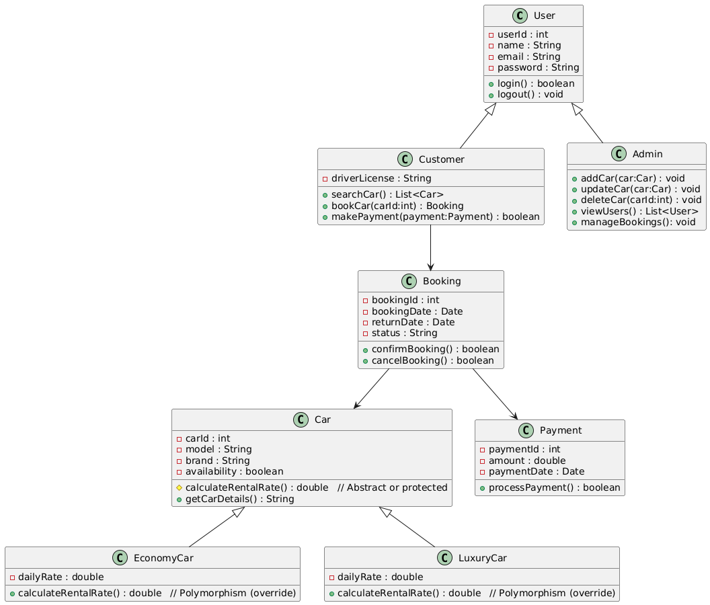
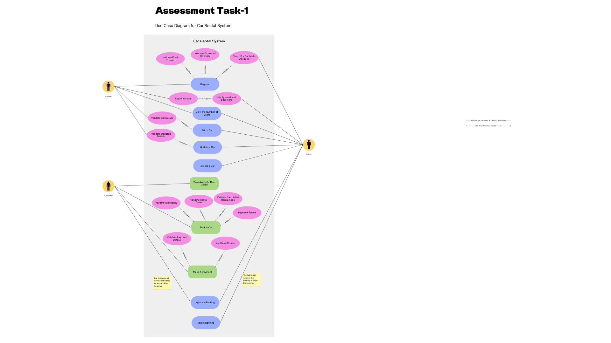
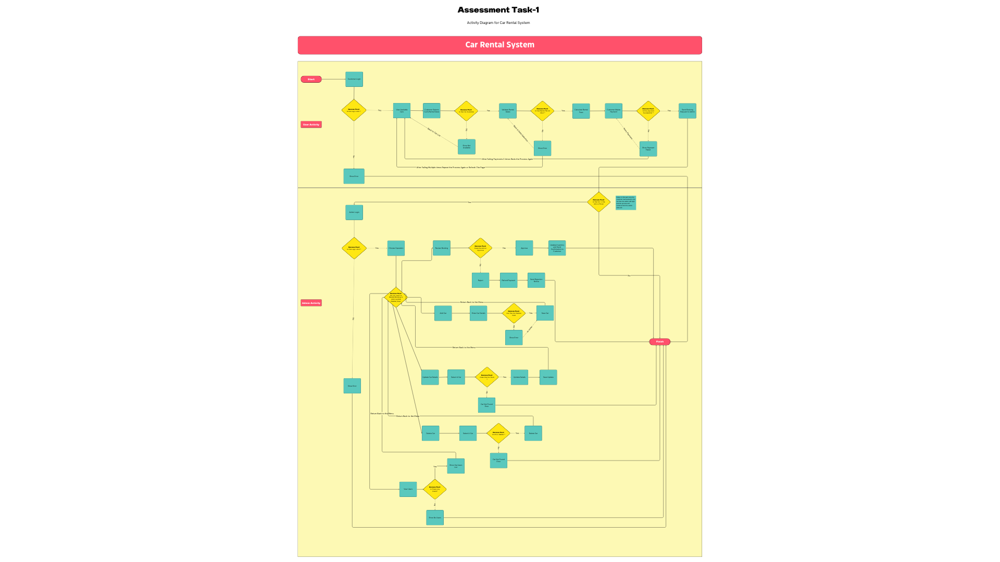
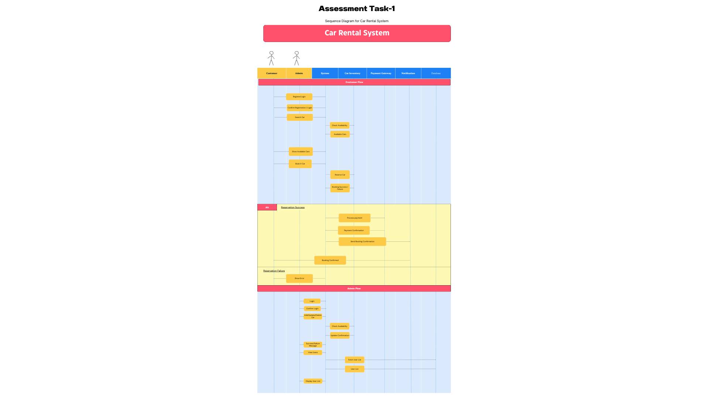

# 🚗 Car Rental System

A simple yet effective **Car Rental Management System** built with **Python** and **MySQL**.  
This project demonstrates **object-oriented design** with appropriate **design patterns** and includes an **innovative feature** to set it apart from traditional systems.  

---

## 📑 Table of Contents
- [Overview](#overview)
- [Features](#features)
- [System Architecture](#system-architecture)
- [Design Pattern Used](#design-pattern-used)
- [Innovative Feature](#innovative-feature)
- [Installation & Setup](#installation--setup)
- [Usage](#usage)
- [Database Schema](#database-schema)
- [Known Issues](#known-issues)
- [License](#license)
- [Credits](#credits)

---

## 📖 Overview
The Car Rental System is designed to streamline the process of **car booking, rental management, and returns**.  
It supports both **customers** (to browse and book cars) and **admins** (to manage cars, bookings, and customers).  

This project fulfills **Task 1 (Design & Architecture)** and **Task 2 (Innovative Solutions)** requirements by:  
- Implementing **object-oriented principles** with modular Python classes.  
- Using the **Factory Method Pattern** to create different types of users (Customer, Admin).  
- Introducing an **innovative QR code–based pickup and return system** for a seamless experience.  

---

## ✨ Features
- Customer and Admin login system.  
- Search and book available cars.  
- Manage rentals and returns.  
- Admin can add, update, or remove cars.  
- Booking confirmations via QR Code (customers scan at pickup/return).  
- Persistent data storage using **MySQL database**.  

---

## 🏗️ System Architecture

### UML Class Diagram

### Use Case Diagram

### Activity Diagram

### Sequence Diagram

