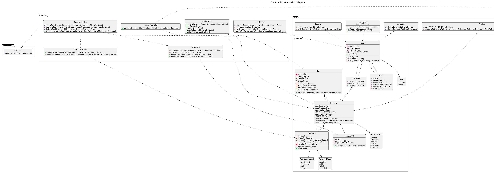

# 🚗 Car Rental System

A simple yet effective **Car Rental Management System** built with **Python** and **MySQL**.  
This project demonstrates **object-oriented design** with appropriate **design patterns** and includes an **innovative feature** (QR code pickup/return) to set it apart from traditional systems.

---

## 📑 Table of Contents
- [Overview](#overview)
- [Requirements Coverage (Checklist)](#requirements-coverage-checklist)
- [Assignment Tasks Alignment](#assignment-tasks-alignment)
- [System Architecture](#system-architecture)
- [Design Pattern Used](#design-pattern-used)
- [Innovative Feature](#innovative-feature)
- [Project Structure](#project-structure)
- [Installation & Setup](#installation--setup)
- [Usage](#usage)
- [Database Schema](#database-schema)
- [Seed Data](#seed-data)
- [Pricing & Payment Flow](#pricing--payment-flow)
- [Validation Rules](#validation-rules)
- [System Documentation (UML)](#system-documentation-uml)
- [Troubleshooting](#troubleshooting)
- [License](#license)
- [Credits](#credits)

---

## 📖 Overview

This CLI application enables:
- **Customers** to browse cars, book rentals, and present **QR codes** at pickup/return.
- **Admins** to manage cars and customers, **approve/reject** bookings, **scan QR** for pickup/return, and record payments.

Key technologies:
- **MySQL** for persistence
- **bcrypt** for password hashing
- **qrcode** (PNG) & **qrcode-terminal** (ASCII QR in terminal)
- **Decimal** for accurate price calculations
- Clean layering: **controllers → models → services → utils → config**

---

## ✅ Requirements Coverage (Checklist)

|ID|Requirement                                                         |Status|               
|a |User registration & login                                           |  
|b |Role-based access (customer vs admin)                               |
|c |Car database with details                                           |
|  |(ID, make/brand, model, year, mileage, availability, min/max period)|
|d |Admin: add/update/delete cars                                       |
|e |Customers can view available cars                                   |
|f |Booking flow: select car, dates, user details                       |
|g |Rental fee calculation                                              |
|h |Admin booking management (approve/reject) 


| ID | Requirement                                                                                    | Status | Where/How it’s implemented                                                                          |
| -: | ---------------------------------------------------------------------------------------------- | -----: | --------------------------------------------------------------------------------------------------- |
|  a | User registration & login                                                                      |      ✅ | `controllers/user_controller.py`, `services/userservice.py`, `utils/security.py`                    |
|  b | Role-based access (customer vs admin)                                                          |      ✅ | `users.role` column; role-aware routing; guards in controllers/services                             |
|  c | Car database with details (ID, make/brand, model, year, mileage, availability, min/max period) |      ✅ | Schema in `db/schema.sql` (`cars` table); listing via `services/car_service.py`                     |
|  d | Admin: add/update/delete cars                                                                  |      ✅ | `car_controller.py` → `CarService.add(...)`, `CarService.update(...)`, `CarService.delete(...)`     |
|  e | Customers can view available cars                                                              |      ✅ | `car_controller.py` → `CarService.list_available_cars(start, end)`                                  |
|  f | Booking flow: select car, dates, user details                                                  |      ✅ | `car_controller.py` → `BookingService.create_booking(...)`                                          |
|  g | Rental fee calculation                                                                         |      ✅ | `utils/pricing.py` (used by `BookingService.create_booking`); total stored in `bookings.total_cost` |
|  h | Admin booking management (approve/reject)                                                      |      ✅ | `booking_service.py` → `approve_booking(...)` (triggers QR generation on approve)                   |


                          |

---

## 🧭 Assignment Tasks Alignment

### Task 1: Design & Architecture (LO1)
- **OO architecture** with layered modules (controllers/services/utils/models/config).
- **Design patterns** documented and selectively implemented (below).
- **High-level diagrams** included (Use Case, Class, Sequence) under **System Documentation (UML)**.

### Task 2: Innovative Solutions (LO2)
- **QR Code–based pickup and return**:
  - On approval, system generates a unique token → saves **PNG** + prints **ASCII** QR (terminal).
  - **Pickup**: scan token → booking `active`, car locked.
  - **Return**: scan token → booking `completed`, car released.
- **Industry value**: Faster counter workflow, paperless handover, foundation for mobile/IoT extension.

### Task 3: Software Evolution (LO2)
- **Maintenance plan** (summarized):
  - **Versioning**: Semantic Versioning (MAJOR.MINOR.PATCH).
  - **Migrations**: versioned SQL in `/db/migrations` (recommend adding for future changes).
  - **Backward compatibility**: additive schema changes first; feature flags; deprecation notes.
  - **Bug fixes**: unit tests for critical flows; reproducible cases; changelog updates.
  - **Release flow**: branch per feature/bug, PR review, tag releases.
  - **Observability**: structured logging; optional audit tables (e.g., QR scans).


---

---

## ✨ Features
- **Role-based login** (admin/customer) with hashed passwords (bcrypt)
- **Admin**:
  - Add / Update / Delete cars
  - Approve / Reject bookings
  - Delete customers (safeguard: cannot delete admins)
- **Customer**:
  - View available cars (date-aware availability)
  - Create bookings (pending → admin approval)
  - View QR code for approved bookings
- **QR codes**:
  - Generated on **approval**
  - Printed as **ASCII** in terminal and saved as **PNG**
  - **Pickup**: scan token → booking → `active`, car locked
  - **Return**: scan token → booking → `completed`, car released
- **MySQL persistence** for users, cars, bookings, payments, QR tokens

---

## 🏗️ System Architecture
- The System for car_rental_system uses MVC architecture as (Model, View ,Control)

**Layers**
- **Controllers** handle input/output and route calls to services.
- **Services** encapsulate business logic and DB access.
- **Utils** centralize cross-cutting concerns (security, pricing, QR, sessions).
- **Config** offers DB connection helpers.

**Key Components**
- **UserService**: registration, login, role lookup.
- **CarService**: CRUD for cars, availability queries.
- **BookingService**: booking lifecycle (create, approve/reject).
- **PaymentService**: create/update pending payments, mark paid.
- **QRService**: generate tokens/PNGs/ASCII, scan at pickup/return.

**Interactions**
- On **create booking**: compute total via `utils/pricing.py` → store in `bookings.total_cost`.
- On **approve**: create/update **pending payment** + **generate QR** (PNG+ASCII).
- On **pickup/return**: state transitions + toggle `cars.available_now`.


---

## 🧩 Design Patterns Used

- **Factory Method (documented)** for extensible entity creation (e.g., user/vehicle subtypes). The current CLI prioritizes services; factories can be added without refactoring.
- **Singleton-like access** for DB via centralized `get_db_connection()` (scoped per call with context managers).
- **Strategy-lite** for pricing via `utils/pricing.compute_total()` (plug tax/fees rules).

---

## Libraries Used

- **Standard Library Module (not a third-party library)**

  - getpass: It hids the password field in the terminal to ensure security.

  - contexlib: It is used to manage and create context managers more easily (like: closing, suppress, ExitStack method ).

  - decimal: used for performing decimal floating-point arithmetic with more precision and control than the built-in float.

  - datetime: used for working with dates and times—like getting the current time, formatting, calculating differences, and scheduling.

  - secrets: It is used to secure tokens and passwords and it is safer than random module.

  - os: It is used to interact with the operating system.

  - re: It is used to check patterns in strings.

  - time: It provides functions to work with time values 

- **Third Party Library Module**

  - bcrypt: It is used for securely hashing and checking passwords.

  - qrcode: it is used to Generate QR codes (as images).

  - qrcode_terminal: It is used to print QR code directly in the terminal instead of saving as an image.

---

## 🚀 Innovative Feature
### QR Code–Based Pickup & Return
- On **approval**, the system creates a unique **token** per booking, stores it in `booking_qr_codes`, prints an **ASCII QR** in terminal, and saves a **PNG** in `/qrcodes`.
- Admin can **scan** (type/paste) the token in terminal:
  - **Pickup** → booking → `active`, car → `available_now = FALSE`
  - **Return** → booking → `completed`, car → `available_now = TRUE`

Why it helps:
- Faster & paperless handover
- Clear audit trail and simple terminal workflow
- Easy to extend to mobile apps / IoT locks later

---

## 🗂️ Project Structure
```text
Car_Rental_System/
│── main.py
│── config/
│ |── database.py
│ |── seed.sql
| └── car_rental.sql
│── controllers/
│ ├── user_controller.py
│ └── admin_controller.py
│── services/
│ ├── userservice.py
│ ├── car_service.py
│ ├── booking_service.py
│ └── qrcode_service.py
│── models/
│ └── models.py
│── pages/
│ ├── adminDashboard.py
│ └── customer_Dashboard.py
│── utils/
│ ├── validators.py
│ ├── auth.py # bcrypt helpers
│ └── qrcode_utils.py # PNG
│── diagrams/
│ ├── class-diagram.png
│ ├── use-case-diagram.png
│ ├── activity-diagram.png
│ └── sequence-diagram.png
│── qrcodes/
│ └── qr_codes.pngs
└── requirements.txt
```

---

## ⚙️ Installation & Setup

### 1) Python & MySQL
- Python 3.10+ recommended
- MySQL 8.0+

### 2) Install dependencies
```bash
pip install -r requirements.txt

```
### 3) Configure DB

- Edit config/database.py to match your local MySQL credentials:

```bash

# config/database.py
import mysql.connector

def get_connection():
    try:
        connection = mysql.connector.connect(
            host='localhost',
            database='car_rental',
            user='root',
            password='root',
            port=3306,
            autocommit=True
        )
        if connection.is_connected():
             print("✅ Database connection established!")
        else:
             print("❌ Database connection failed.")
        return connection
    except Error as e:
        print(f"Error connecting to database: {e}")
        return None

```

### 4) Create schema & seed data

Copy /config/schema.sql and /config/seed.sql from the sections below into files and run them in MySQL Workbench or CLI:

mysql -u root -p < config/schema.sql
mysql -u root -p < config/seed.sql

Import seed directly in MySQL workbench terminal for better results

### 5) Run the app (CLI)

- If you prefer package-style execution, add __init__.py files and run python -m Car_Rental_System.main.

## 🕹️ Usage

### Customer
- **View Available Cars** (optionally filter by dates)
- **Book Car** → status `pending`, `total_cost` computed
- **Show QR for Approved Booking** (re-print ASCII QR & PNG path)

### Admin
- **Manage Cars**: add / update / delete / list
- **Approve/Reject Bookings**
  - On approval: **pending payment** row created/updated
  - On approval: **QR** generated (PNG saved, ASCII printed)
- **Scan QR**: Pickup (→ `active`), Return (→ `completed`)
- **Record Payment**: mark **PAID** (method + optional provider txn id)

## 🧱 Database Schema

- **users**: `user_id`, `name`, `email (unique)`, `password (bcrypt)`, `role (admin|customer)`, `created_at`, `updated_at`
- **cars**: `car_id`, `brand`, `model`, `year`, `mileage`, `daily_rate`, `min_period_days`, `max_period_days`, `available_now`, `created_at`, `updated_at`
- **bookings**: `booking_id`, `user_id`, `car_id`, `start_date`, `end_date`, `status`, `total_cost`, `approved_by`, `pickup_at`, `return_at`
- **payments**: `payment_id`, `booking_id`, `amount`, `payment_method`, `payment_status`, `provider_txn_id`, `payment_date`
- **booking_qr_codes**: `qr_id`, `booking_id (UNIQUE)`, `qr_token (UNIQUE)`, `expires_at`, `created_at`

```bash

DB: car_rental
Tables: users, cars, bookings, payments, booking_qr_codes and view v_available_cars.

Place this as config/schema.sql:

-- =========================
-- Car Rental DB (SCHEMA)
-- =========================
CREATE DATABASE IF NOT EXISTS car_rental
  CHARACTER SET utf8mb4 COLLATE utf8mb4_0900_ai_ci;

USE car_rental;

-- ========== USERS ==========
CREATE TABLE IF NOT EXISTS users (
    user_id    INT AUTO_INCREMENT PRIMARY KEY,
    name       VARCHAR(100) NOT NULL,
    email      VARCHAR(100) NOT NULL UNIQUE,
    password   VARCHAR(255) NOT NULL,  -- bcrypt-safe
    role       ENUM('customer','admin') NOT NULL DEFAULT 'customer',
    created_at TIMESTAMP NOT NULL DEFAULT CURRENT_TIMESTAMP,
    updated_at TIMESTAMP NULL DEFAULT NULL ON UPDATE CURRENT_TIMESTAMP
) ENGINE=InnoDB;

CREATE INDEX idx_users_email ON users(email);

-- =========== CARS ==========
CREATE TABLE IF NOT EXISTS cars (
    car_id          INT AUTO_INCREMENT PRIMARY KEY,
    brand           VARCHAR(100) NOT NULL,
    model           VARCHAR(100) NOT NULL,
    year            INT NULL,
    mileage         INT NULL,
    daily_rate      DECIMAL(10,2) NOT NULL DEFAULT 0.00,
    min_period_days INT NULL,
    max_period_days INT NULL,
    available_now   BOOLEAN NOT NULL DEFAULT TRUE,
    created_at      TIMESTAMP NOT NULL DEFAULT CURRENT_TIMESTAMP,
    updated_at      TIMESTAMP NULL DEFAULT NULL ON UPDATE CURRENT_TIMESTAMP
) ENGINE=InnoDB;

CREATE INDEX idx_cars_available    ON cars(available_now);
CREATE INDEX idx_cars_brand_model  ON cars(brand, model);

-- ========= BOOKINGS =========
CREATE TABLE IF NOT EXISTS bookings (
    booking_id    INT AUTO_INCREMENT PRIMARY KEY,
    user_id       INT NOT NULL,
    car_id        INT NOT NULL,
    start_date    DATE NOT NULL,
    end_date      DATE NOT NULL,
    status        ENUM('pending','approved','rejected','active','completed','cancelled')
                  NOT NULL DEFAULT 'pending',
    total_cost    DECIMAL(10,2) NULL,
    approved_by   INT NULL,
    created_at    TIMESTAMP NOT NULL DEFAULT CURRENT_TIMESTAMP,
    updated_at    TIMESTAMP NULL DEFAULT NULL ON UPDATE CURRENT_TIMESTAMP,

    CONSTRAINT fk_bookings_user
      FOREIGN KEY (user_id) REFERENCES users(user_id)
      ON DELETE CASCADE ON UPDATE CASCADE,

    CONSTRAINT fk_bookings_car
      FOREIGN KEY (car_id) REFERENCES cars(car_id)
      ON DELETE RESTRICT ON UPDATE CASCADE,

    CONSTRAINT fk_bookings_admin
      FOREIGN KEY (approved_by) REFERENCES users(user_id)
      ON DELETE SET NULL ON UPDATE CASCADE,

    CONSTRAINT chk_booking_dates CHECK (end_date >= start_date)
) ENGINE=InnoDB;

CREATE INDEX idx_bookings_user    ON bookings(user_id);
CREATE INDEX idx_bookings_car     ON bookings(car_id);
CREATE INDEX idx_bookings_status  ON bookings(status);
CREATE INDEX idx_bookings_dates   ON bookings(start_date, end_date);

-- ========= PAYMENTS =========
CREATE TABLE IF NOT EXISTS payments (
    payment_id      INT AUTO_INCREMENT PRIMARY KEY,
    booking_id      INT NOT NULL,
    amount          DECIMAL(10,2) NOT NULL,
    payment_method  ENUM('credit_card','debit_card','cash','paypal') NOT NULL DEFAULT 'cash',
    payment_status  ENUM('pending','paid','failed','refunded') NOT NULL DEFAULT 'pending',
    provider_txn_id VARCHAR(100) NULL,
    payment_date    DATETIME NOT NULL DEFAULT CURRENT_TIMESTAMP,

    CONSTRAINT fk_payments_booking
      FOREIGN KEY (booking_id) REFERENCES bookings(booking_id)
      ON DELETE CASCADE ON UPDATE CASCADE
) ENGINE=InnoDB;

CREATE INDEX idx_payments_booking ON payments(booking_id);
CREATE INDEX idx_payments_status  ON payments(payment_status);

-- ======= QR CODE TOKENS =======
CREATE TABLE IF NOT EXISTS booking_qr_codes (
    qr_id       INT AUTO_INCREMENT PRIMARY KEY,
    booking_id  INT NOT NULL UNIQUE,
    qr_token    VARCHAR(128) NOT NULL UNIQUE,
    expires_at  DATETIME NULL,
    created_at  TIMESTAMP NOT NULL DEFAULT CURRENT_TIMESTAMP,

    CONSTRAINT fk_qr_booking
      FOREIGN KEY (booking_id) REFERENCES bookings(booking_id)
      ON DELETE CASCADE ON UPDATE CASCADE
) ENGINE=InnoDB;

CREATE INDEX idx_qr_token ON booking_qr_codes(qr_token);

-- ============ VIEW ============
CREATE OR REPLACE VIEW v_available_cars AS
SELECT car_id, brand, model, year, mileage, daily_rate
FROM cars
WHERE available_now = TRUE;

```
### 🌱 Seed Data

```bash

-- =========================
-- Car Rental DB (SEED DATA)
-- Run AFTER car_rental.sql
-- =========================
USE car_rental;

START TRANSACTION;

-- 1) Users (admin + customer)
-- Passwords are bcrypt-hashed for:
--   Admin:     "AdminPass123!"
--   Customer:  "CustomerPass123!"
INSERT INTO users (name, email, password, role) VALUES
('Alice Admin',    'admin@carrental.com',  '$2b$12$roomjk62e3NBDhYtZqxloeu2Ek7.l7Ea0CYvt2v6yMUdVvGCMfnwm', 'admin'),
('Carl Customer',  'carl@example.com',     '$2b$12$cW5/msidThEkBdyCqb8BA.KR3FKc9eTtMTk2tqXDII1ildSkx.pIy', 'customer');

-- 2) Cars
INSERT INTO cars
(brand, model, year, mileage, daily_rate, min_period_days, max_period_days, available_now)
VALUES
('Toyota','Corolla',       2020, 42000, 49.99, 1, 30, TRUE),
('Toyota','Camry',         2021, 36000, 59.99, 1, 30, TRUE),
('Toyota','RAV4',          2019, 58000, 69.99, 1, 30, TRUE),
('Honda','Civic',          2020, 39000, 52.00, 1, 30, TRUE),
('Honda','CR-V',           2018, 74000, 65.00, 1, 30, TRUE),
('Ford','Focus',           2019, 61000, 45.00, 1, 30, TRUE),
('Ford','Escape',          2020, 50000, 63.50, 1, 30, TRUE),
('Nissan','Sentra',        2019, 67000, 44.00, 1, 30, TRUE),
('Nissan','X-Trail',       2021, 33000, 64.00, 1, 30, TRUE),
('Hyundai','Elantra',      2022, 21000, 53.00, 1, 30, TRUE),
('Hyundai','Tucson',       2019, 59000, 60.00, 1, 30, TRUE),
('Kia','Sportage',         2020, 47000, 61.00, 1, 30, TRUE),
('Volkswagen','Golf',      2018, 82000, 42.50, 1, 30, TRUE),
('Volkswagen','Tiguan',    2021, 28500, 66.00, 1, 30, TRUE),
('BMW','3 Series',         2020, 41000, 95.00, 2, 21, TRUE),
('Mercedes-Benz','C-Class',2019, 52000, 99.00, 2, 21, TRUE),
('Audi','Q5',              2021, 30000,109.00, 2, 21, TRUE),
('Tesla','Model 3',        2022, 18000,119.00, 1, 21, TRUE),
('Tesla','Model Y',        2023, 12000,129.00, 1, 21, TRUE);

-- 3) Example booking (approved)
-- Assumes: user_id=2 (Carl), car_id=1 (Corolla), admin user_id=1
INSERT INTO bookings (user_id, car_id, start_date, end_date, status, total_cost, approved_by)
VALUES (2, 1, '2025-09-06', '2025-09-08', 'approved', 149.97, 1);

-- 4) Example payment for that booking (booking_id=1)
INSERT INTO payments (booking_id, amount, payment_method, payment_status, provider_txn_id)
VALUES (1, 149.97, 'cash', 'paid', 'DEMO-TXN-001');

-- 5) Example QR token for that booking
INSERT INTO booking_qr_codes (booking_id, qr_token, expires_at)
VALUES (1, 'QR-BOOKING-1-DEMO-TOKEN-ABC123', DATE_ADD(NOW(), INTERVAL 7 DAY));

COMMIT;

```
---

## 💵 Pricing & Payment Flow

- **Computation** in `utils/pricing.py` using `Decimal`:
  - Inclusive day count: `(end - start) + 1`
  - Enforces `min_period_days` / `max_period_days`
  - Optional fees & tax parameters
- **On create booking**: `bookings.total_cost` is stored
- **On approval**: a **pending payment** is created or updated for that `booking_id`
- **Mark Paid**: admin action to update payment status to `paid`

---
## ✅ Validation Rules

- **Email**: format check + **unique** in DB

- **Password**: ≥ 6 characters, at least 1 uppercase & 1 number **bcrypt** hashed

- **Dates**: `end_date >= start_date`; overlap checks for availability

- **Role checks**: customer (default) and admin-only actions guarded in controllers/services

- **Session**: token verified on each dashboard action

- **Booking dates**: end_date >= start_date (also validated in service layer)

- **Avaliability**: overlap checks for pending/approved/active bookings

## 📐 System Documentation (UML)

The UML Diagrams are listed Below 

- **Class Diagram:** 

- **Use Case:** 

- **Activity Diagram:** 

- **Sequence Diagram:** 

> Diagrams are provided as images. See `/diagrams/` for the source files/screenshots you created.

---

### 🔧 Software Evolution Plan (Task 3)

- **Maintenance**
  - Structured logging (add a `utils/logging.py`); error handling with clear messages.
  - Unit tests for auth, pricing, booking state transitions.
  - Linting & CI (flake8/black + GitHub Actions).
- **Versioning**
  - Semantic Versioning: `MAJOR.MINOR.PATCH`.
  - Maintain a `CHANGELOG.md`.
- **Backward Compatibility**
  - Additive schema changes first; deprecate before remove.
  - Feature flags for risky features.
  - Migration scripts in `/db/migrations` (use timestamps in filenames).

---

## 🧰 Troubleshooting

- **ImportError (relative imports)** → use absolute imports or run as module.
- **Cursor not connected** → use one connection per method; close with context managers.
- **Login fails** → ensure bcrypt hashes are stored; `VARCHAR(255)` for password column.
- **QR issues** → ensure `./qrcodes` exists/writable; `qrcode` & `qrcode-terminal` installed.
- **Date checks** → MySQL < 8.0 ignores CHECK → enforce in Python (already implemented).

---

## 📜 License

- MIT License — see `LICENSE`.

## 👨‍💻 Credits

- Developed by **Parvez Hasan** (Software Engineer) — 2025


---

## 📦 `requirements.txt`

- Create this file in the repo root:

```bash
mysql-connector-python>=8.3.0
bcrypt>=4.1.2
qrcode>=7.4.2
qrcode-terminal>=0.8
```
